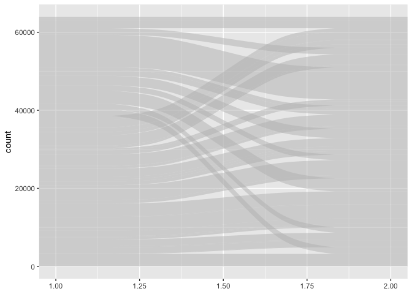
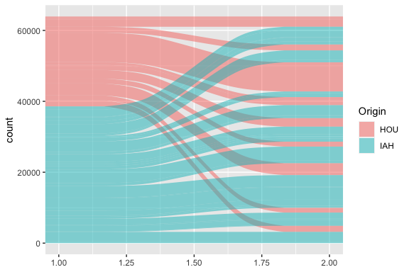
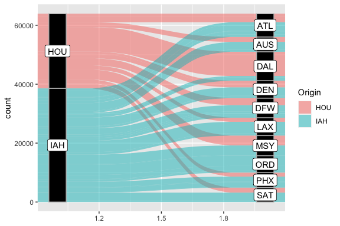
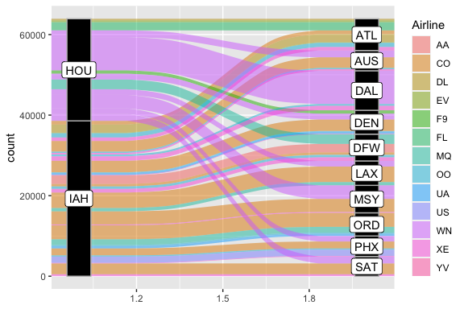
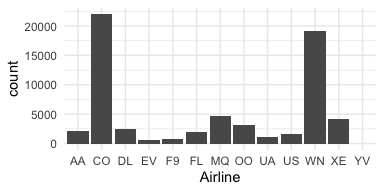
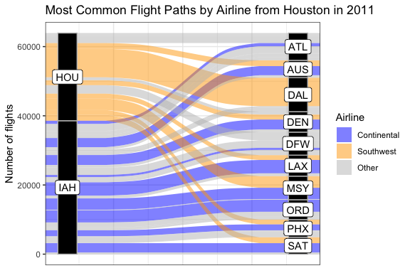

Mod 5: Visualizing Flow Data
================
Cassy Dorff

# Overview

Today we will work through a short demonstration on how to illustrate
flows using alluvial diagrams. Alluvial diagrams were originally
developed to visualize structural change in large complex networks. In
essence, they are particularly good at revealing how changes in network
structures have developed over time. An excellent illustration is to
imagine air traffic flows from one airport to another, which we will do
today.

First, lets library our packages. The ggalluvial package is a ggplot2
extension for producing alluvial plots in a tidyverse framework.

``` r
# install.packages("ggalluvial")
# install.packages("hflights")
library(ggalluvial)
library(tidyverse)
library(hflights)
```

Today, we will be working with a data set from the `hflights` package.
The data set contains all flights from the Houston IAH and HOU airports
in 2011. Install the package `hflights`, load it into the library,
extract the data frame into a new object called `raw` and inspect the
data frame.

**NOTE:** The `::` operator specifies that we want to use the *object*
`hflights` from the *package* `hflights`. In the case below, this
explicit programming is not necessary. However, it is useful when
functions or objects are contained in multiple packages to avoid
confusion. A classic example is the `select()` function that is
contained in a number of packages besides `dplyr`.

``` r
raw <- hflights::hflights
str(raw)
```

    ## 'data.frame':    227496 obs. of  21 variables:
    ##  $ Year             : int  2011 2011 2011 2011 2011 2011 2011 2011 2011 2011 ...
    ##  $ Month            : int  1 1 1 1 1 1 1 1 1 1 ...
    ##  $ DayofMonth       : int  1 2 3 4 5 6 7 8 9 10 ...
    ##  $ DayOfWeek        : int  6 7 1 2 3 4 5 6 7 1 ...
    ##  $ DepTime          : int  1400 1401 1352 1403 1405 1359 1359 1355 1443 1443 ...
    ##  $ ArrTime          : int  1500 1501 1502 1513 1507 1503 1509 1454 1554 1553 ...
    ##  $ UniqueCarrier    : chr  "AA" "AA" "AA" "AA" ...
    ##  $ FlightNum        : int  428 428 428 428 428 428 428 428 428 428 ...
    ##  $ TailNum          : chr  "N576AA" "N557AA" "N541AA" "N403AA" ...
    ##  $ ActualElapsedTime: int  60 60 70 70 62 64 70 59 71 70 ...
    ##  $ AirTime          : int  40 45 48 39 44 45 43 40 41 45 ...
    ##  $ ArrDelay         : int  -10 -9 -8 3 -3 -7 -1 -16 44 43 ...
    ##  $ DepDelay         : int  0 1 -8 3 5 -1 -1 -5 43 43 ...
    ##  $ Origin           : chr  "IAH" "IAH" "IAH" "IAH" ...
    ##  $ Dest             : chr  "DFW" "DFW" "DFW" "DFW" ...
    ##  $ Distance         : int  224 224 224 224 224 224 224 224 224 224 ...
    ##  $ TaxiIn           : int  7 6 5 9 9 6 12 7 8 6 ...
    ##  $ TaxiOut          : int  13 9 17 22 9 13 15 12 22 19 ...
    ##  $ Cancelled        : int  0 0 0 0 0 0 0 0 0 0 ...
    ##  $ CancellationCode : chr  "" "" "" "" ...
    ##  $ Diverted         : int  0 0 0 0 0 0 0 0 0 0 ...

## Preparing the Data

First, let’s use only a subsample of variables in the data frame,
specifically the year of the flight, the airline, as well as the origin
airport, the destination, and the distance between the airports.

Notice a couple of things in the code below:

-   We assign the output to a new data set.
-   We use the piping operator to connect commands and create a single
    flow of operations.
-   We use the select function to rename variables.
-   Instead of typing each variable, we can select sequences of
    variables.
-   Note that the `everything()` command inside `select()` will select
    all variables.

``` r
data <-  raw %>%
  dplyr::select(Month,
                DayOfWeek,
                DepTime,
                ArrTime,
                ArrDelay,
                TailNum,
                Airline = UniqueCarrier, #Renaming the variable
                Time = ActualElapsedTime, #Renaming the variable
                Origin:Cancelled) #Selecting a number of columns. 
names(data)
```

    ##  [1] "Month"     "DayOfWeek" "DepTime"   "ArrTime"   "ArrDelay"  "TailNum"  
    ##  [7] "Airline"   "Time"      "Origin"    "Dest"      "Distance"  "TaxiIn"   
    ## [13] "TaxiOut"   "Cancelled"

Suppose we didn’t really want to select the `Cancelled` variable. We can
also use `select()` to drop variables.

``` r
data <- data %>%
  dplyr::select(-Cancelled)
```

## Alluvial diagrams

Now we have the data ready to explore using alluvial diagrams.

Houston is the fourth most populous city in the nation, with an
estimated July 2018 population of 2,325,502 (trailing only New York, Los
Angeles and Chicago).

Here is our motivating question: *There are two airports in Houston, TX.
Houston is one of the largest cities in the United States. What are
Houston airports’ top ten most frequent destinations for passengers?*

We can visualize the combination of origin airport (IAH and HOU) and
destination airports using alluvial diagrams. First, we create a
frequency table for all observed combinations of origin and destination
airport for the ten most common destinations using `group_by()` and
`slice()`.

``` r
# create new data object
dest_top10 <- data %>% 
  group_by(Dest) %>% #group by destination
  summarise(count = n()) %>% #count up total # of flights
  arrange(desc(count)) %>% #order these from low to high, i.e. descending order
  slice(1:10) #take the top ten values 

flows <- data %>% #new data object for graphing
  filter(Dest %in% dest_top10$Dest) %>% #filter data$Dest by top 10 cases object
  group_by(Origin, #group by origin, destination, and airline summarize using counts
           Dest,
           Airline) %>%
  summarise(count = n())
```

Now that we have our data ready, we can try our hand at a basic alluvial
plot. Below, we use the `ggalluvial` package, which contains the
`geom_alluvium()` geometric object. Note the basic structure is similar
to `ggplot()` except now we have axis to denote where the data are
flowing from left to right.

``` r
ggplot(flows, aes(y = count, axis1 = Origin, axis2 = Dest)) +
  geom_alluvium()
```

<!-- -->

We can easily use `fill` to make the graph more interesting. Note,
because we want to add `fill` to the alluvium geom, we will map `Origin`
onto `fill` within the aesthetic mappings function below. This will help
us visualize where flights come from and where they end up.

``` r
ggplot(flows,aes(y = count, axis1 = Origin, axis2 = Dest)) +
  geom_alluvium(aes(fill = Origin))
```

<!-- -->

We should also add labels to illustrate the destination airports. To add
a bit more clarity to the graphic, we will also want to be able to
understand the different groupings shown by the strata in the plot. Here
we can use the `geom_stratum()` geometric object to clarify the
groupings by plotting rectangles across the groups. Then we will add
labels to the boxes.

``` r
ggplot(flows,aes(y = count,axis1 = Origin, axis2 = Dest)) +
  geom_alluvium(aes(fill = Origin)) +
  geom_stratum(width = 1/12, fill = "black", color = "grey") +
  # label the geom stratum inside the graph
  # after_stat delays labeling until after the 
  geom_label(stat = "stratum", aes(label = after_stat(stratum)))
```

<!-- -->

The plot above looks nice, and to some extent we have visualized our
original question, which asked us to show the top ten most frequent
destinations. But is the distinction by fill that interesting?

Perhaps we want to know a bit more about flight patterns, particularly
as they relate to the airlines that operate out of Houston. What if we
focus on showing the common flight patterns across airlines?

Note: An important feature of these plots is the meaningfulness of the
vertical axis: No gaps are inserted between the strata, so the total
height of the plot reflects the cumulative quantity of the observations.

``` r
ggplot(flows,aes(y = count, axis1 = Origin, axis2 = Dest)) +
  geom_alluvium(aes(fill = Airline)) +
  geom_stratum(width = 1/12, fill = "black", color = "grey") +
  geom_label(stat = "stratum", aes(label = after_stat(stratum)))
```

<!-- -->

The plot above is hardly legible because there are too many airlines
displayed!

A reasonable solution is to only display *well-known* airlines. First,
let’s create a quick barplot to check which airlines are the most common
carriers on the top ten routes. Then, we will create a new variable
coding only the most common, i.e. “Continental” (CO), “Southwest” (WN),
and “Other” using `case_when()`.

Note: recall that if you want the heights of the bars in a barplot to
represent values in the data, use `stat="identity"` and map a value to
the y aesthetic (the barplot will represent the Y values). Also
`case_when` allows you to vectorise multiple `if_else` statements,
`TRUE` here is equivalent to `ELSE` statement. The help file has a very
useful little toy example!

``` r
ggplot(flows, aes(x = Airline,y = count)) +
  geom_bar(stat = "identity") +
  theme_minimal()
```

<!-- -->

``` r
# Creat a new indicator
flows <- flows %>%
  mutate(Airline_reduced = case_when( # new variable "airline reduced"
    Airline == "CO" ~ "Continental", # when airline == CO, name it "Continental"
    Airline == "WN" ~ "Southwest",
    T ~ "Other" # else, name it "Other"
  ) %>% factor(levels = c('Continental', 'Southwest', 'Other'))) #so R does not think it is numeric

# does this check out?
table(flows$Airline_reduced)
```

    ## 
    ## Continental   Southwest       Other 
    ##           9           7          30

Now, we can re-plot the alluvial diagram replacing the alluviam’s color
fill with the new airline reduced information. Note, the x-axis labels
are not super meaningful and typically are not shown unless they are
used to label steps/left-to-right axes.

## Try on your own

``` r
ggplot(flows,aes(y = count, axis1 = Origin, axis2 = Dest)) +
  geom_alluvium(aes(fill = Airline_reduced)) +
  geom_stratum(width = 1/12, fill = "black", color = "grey") +
  geom_label(stat = "stratum", aes(label = after_stat(stratum))) +
  ylab('Number of flights') +
  ggtitle('Most Common Flight Paths by Airline from Houston in 2011') +
  theme_bw() +
  theme(axis.text.x = element_blank(), 
        axis.ticks.x = element_blank()) +
  guides(fill = guide_legend(title = 'Airline')) +
  scale_fill_manual(values = c('blue', 'orange', 'gray'))
```

<!-- -->

## References

-   use case example from:
    <https://github.com/thereseanders/workshop-dataviz-fsu>
-   alluvial diagrams:
    <https://journals.plos.org/plosone/article?id=10.1371/journal.pone.0008694>
-   flights data: <https://github.com/hadley/hflights>
-   ggalluvial: <http://corybrunson.github.io/ggalluvial/>
